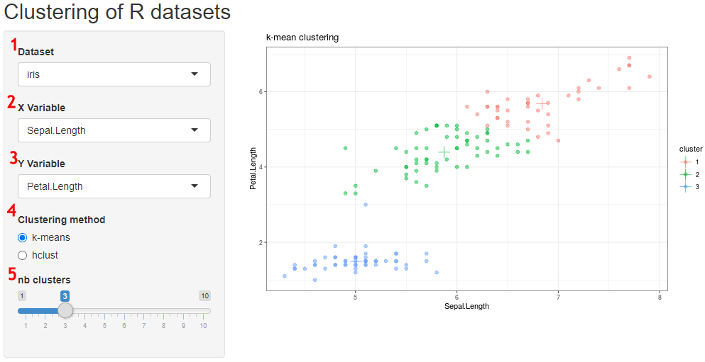

# Introduction
This appliation let you choose a dataset and perform k-means clustering or hierarchical clustering. 

# User inputs: 
## 1. Dataset: 
Enables the user to chose a dataset. The available datasets include:  
\code{iris, airquality, mtcars, trees, rock}

## 2. X Variable / 3. Y Variable
Enables the user to choose which numerical variable is displayed on the x and y axis. Note that this is relevant only when the clustering method is set to *k-means*. 

## 4. Clustering method: 
The user can choose between a k-means clustering method, and a hierarchical clustering. 

### k-means
The dataset and selected X and Y variables are processed using *k-means()* function with the selected dataset and the number of cluster defined under *nb clusters*. The output is a scatter plot with color representing the clusters, and + symbol showing cluster centers. 

### hclust
The hierarchical clustering is performed using R's *dist()* and *hclust()* functions, with the *ward.D2* method. The output is a dendrogram showing the hierarchie between observatons, and a red box defining the clusters. 

## 5. nb clusters
The number of clusters wanted by the user for *k-means* and *hclust* methods. Its min value is 1 and max value is 10. 